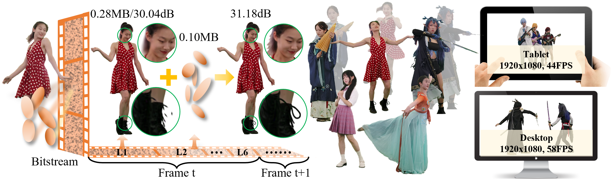

# <center> 4DGCPro: Efficient Hierarchical 4D Gaussian Compression for Progressive Volumetric Video Streaming [NeurIPS 2025] </center>

<p>
<div style="text-align: center;">
<a href="https://zihanzheng-sjtu.github.io/">Zihan Zheng, Zhenlong Wu, Houqiang Zhong, Yuan Tian, Ning Cao, Lan Xu, Jiangchao Yao
Xiaoyun Zhang, 
<a href="https://qianghu-huber.github.io/qianghuhomepage/">Qiang Hu</a><sup>&dagger;</sup>,
Wenjun Zhang
</div>
</p>

<p>
<div style="text-align: center;">
<a href="[[https://mediax-sjtu.github.io/4dgc/](https://mediax-sjtu.github.io/4DGCPro/)](https://mediax-sjtu.github.io/4DGCPro/)">[Project Page]</a>,
<a href="[https://arxiv.org/abs/2503.18421v1](https://arxiv.org/abs/2509.17513)](https://arxiv.org/abs/2509.17513)">[arXiv]</a>
</div>
</p>



## Citation

```
@misc{zheng20254dgcproefficienthierarchical4d,
      title={4DGCPro: Efficient Hierarchical 4D Gaussian Compression for Progressive Volumetric Video Streaming}, 
      author={Zihan Zheng and Zhenlong Wu and Houqiang Zhong and Yuan Tian and Ning Cao and Lan Xu and Jiangchao Yao and Xiaoyun Zhang and Qiang Hu and Wenjun Zhang},
      year={2025},
      eprint={2509.17513},
      archivePrefix={arXiv},
      primaryClass={cs.CV},
      url={https://arxiv.org/abs/2509.17513}, 
}
```
